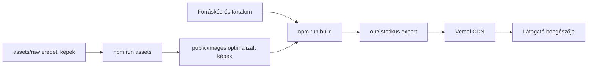

# Libraszalon Működési és Karbantartási Leírás

## Rendszer Áttekintése

A Libraszalon weboldal Next.js 16 és React 19 alkalmazás, amely production környezetben teljesen statikus webhelyként működik. A `npm run build` minden útvonalból előre elkészíti a HTML, CSS, JavaScript, kép- és metaadatfájlokat. A Vercel ezeket a fájlokat CDN-ről szolgálja ki.

Nincs alkalmazásszerver, adatbázis, saját API vagy látogatónkénti szerveroldali adatfeldolgozás. Ez alacsony üzemeltetési költséget, gyors betöltést és kis támadási felületet ad.



## Mappák és Felelősségek

| Hely | Tartalom | Mikor kell módosítani |
| --- | --- | --- |
| `src/app/` | Oldalútvonalak, globális layout, metadata route-ok és CSS | Új oldal, globális megjelenés vagy SEO route változásakor |
| `src/components/` | Újrahasznosítható React komponensek | Megjelenés vagy interaktív viselkedés módosításakor |
| `src/content/` | Szerkesztői adatok: szövegek, árak, szolgáltatások, értékelések | Üzleti tartalom változásakor |
| `src/lib/` | Közös, keretrendszerfüggetlen logika | Új közös viselkedés vagy SEO/image segédfunkció esetén |
| `scripts/` | Lokálisan futó asset-előkészítő és kiadás-ellenőrző eszközök | Nem kerülnek a böngészőcsomagba |
| `assets/raw/` | Képeredetik ideiglenes lokális tára | Csak az asset pipeline használja; gitignore-olt |
| `public/` | Kiszolgálandó statikus fájlok | Képek, ikonok és Open Graph kép célhelye |
| `out/` | Buildelt, deployolható statikus webhely | Generált fájl, kézzel nem szerkesztendő |

## Oldalbetöltés

1. A látogató például a `/arak/` útvonalat kéri.
2. A Vercel CDN a build során elkészült statikus HTML-t küldi vissza.
3. A böngésző azonnal megjeleníti a HTML tartalmát, ezért az alapoldal JavaScript nélkül is olvasható és navigálható.
4. A csak interaktív komponensek hidratálódnak a kliensoldalon: mobil menü, bemutatkozó animáció, közlemény, vissza a tetejére gomb és értékelés-carousel.
5. A `Picture` komponens a készülék szélességéhez megfelelő AVIF vagy WebP képet választja. Az előre tárolt képméretek csökkentik a layout elmozdulását.
6. A Google Maps iframe csak a kapcsolatoldalon, késleltetve töltődik be.

## Tartalom Szerkesztése

A szövegek és üzleti adatok nem JSX komponensekbe vannak írva, hanem a `src/content/` mappában.

| Feladat | Elsődleges fájl |
| --- | --- |
| Cím, telefonszám, e-mail, nyitvatartás, közösségi linkek | `src/content/site.ts` |
| Szolgáltatások | `src/content/services.ts` |
| Árak | `src/content/prices.ts` |
| Főoldal szövegei | `src/content/pages/home.ts` |
| Bemutatkozás szövegei | `src/content/pages/about.ts` |
| Árlista, első kezelés és házirend oldalak szövegei | `src/content/pages/` |
| Kapcsolatoldal szövegei | `src/content/pages/contact.ts` |
| Kapacitásról szóló közlemény | `src/content/notice.ts` |
| Jóváhagyott Google értékelések | `src/content/reviews.json` |
| Oldalcímek, leírások és sitemap prioritások | `src/content/seo.ts` |

Az értékelések statikus, jóváhagyott tartalomként szerepelnek a `reviews.json` fájlban. A weboldal nem hív Google API-t, és nincs automatikus Google review-szinkron. Új értékelést kézzel kell ebbe a JSON fájlba felvenni.

## A `scripts/` Mappa

A scriptek csak fejlesztői/karbantartási eszközök. A Vercel build nem futtatja őket automatikusan. A jelenlegi mappa három feladatot lát el.

### `scripts/assets.ts`

Ez a kép-pipeline központi konfigurációja.

- Felsorolja az eredeti WordPress képek útvonalát és a weboldalon használt rövid azonosítójukat.
- Megadja, mely képek legyenek fix méretűek, melyek kapjanak reszponzív méretlépcsőket és melyek dekoratív hátterek.
- Meghatározza a be- és kimeneti mappákat: `assets/raw/`, `public/images/` és `src/lib/images.manifest.json`.

Új képnél először ide kell új bejegyzést felvenni. A `slug` lesz a generált fájlok neve és a `Picture` komponens azonosítója.

### `scripts/fetch-assets.ts`

Ez letölti az `assets.ts`-ben felsorolt képeredetiket a korábbi WordPress oldal feltöltési könyvtárából.

```bash
npm run assets:fetch
```

- A fájlokat az `assets/raw/` mappába írja.
- A már meglévő, nem üres fájlokat nem tölti le újra.
- Internetkapcsolat szükséges hozzá.
- Az `assets/raw/` nincs Gitben, mert csak ideiglenes munkabemenet.

Ezt akkor kell futtatni, amikor egy új eredeti kép bekerül az `assets.ts` fájlba, vagy az eredeti képet frissíteni kell.

### `scripts/optimize-images.ts`

Ez készíti el a weboldal által ténylegesen használt optimalizált képeket.

```bash
npm run assets:optimize
```

- Beolvassa az `assets/raw/` eredetiket.
- AVIF és WebP változatokat hoz létre több kijelzőszélességhez.
- Nem nagyít fel képet az eredeti felbontása fölé.
- A dekoratív háttérképeket erősebben tömöríti.
- Frissíti a `src/lib/images.manifest.json` fájlt a méretekkel és az elérhető szélességekkel.
- Elkészíti a faviconokat: `src/app/icon.png`, `src/app/apple-icon.png`, `public/icon-192.png`, `public/icon-512.png`.
- Elkészíti a `public/og/default.jpg` Open Graph megosztási képet.

Az összes képes feladat egyben futtatható:

```bash
npm run assets
```

Ez előbb letölt, utána optimalizál. A generált `public/images/` képeket és az image manifestet commitolni kell, mert a production build ezekből dolgozik.

### `scripts/verify.mts`

Ez a saját kiadás előtti böngészős ellenőrzés. Playwright Core segítségével megnyitja a kész statikus exportot, és több képernyőméreten vizsgálja az oldalakat.

```bash
npm run build
npm run verify
```

A `verify` csak előbb elkészült `out/` mappával futtatható. Ha nincs külön szerver, saját lokális HTTP szervert indít a buildelt fájlokhoz.

Az ellenőrzés a következőket vizsgálja:

- vízszintes túlcsordulás 320, 360, 390, 768, 1024 és 1440 pixel szélességnél;
- WCAG 1.4.10 reflow helyzet 320x256 pixeles nézetben;
- 200%-os szövegnagyítás;
- minden oldalon pontosan egy `h1`;
- legalább 44x44 pixeles kattintható célok, ahol ez elvárható;
- scroll-reveal elemek láthatóvá válása;
- mobil menü nyitása, mérete, linkjei, Escape bezárása és navigáció utáni bezárása;
- JavaScript nélküli olvashatóság és navigálhatóság.

## Fejlesztési és Kiadási Parancsok

| Parancs | Cél |
| --- | --- |
| `npm install` | Függőségek telepítése helyi fejlesztéshez |
| `npm run dev` | Next.js fejlesztői szerver indítása |
| `npm run lint` | ESLint kódminőség-ellenőrzés |
| `npm run typecheck` | TypeScript típusellenőrzés fájlkibocsátás nélkül |
| `npm run build` | Production statikus export létrehozása az `out/` mappába |
| `npm run verify` | A buildelt oldal reszponzív és hozzáférhetőségi auditja |
| `npm run assets:fetch` | Eredeti képek letöltése a WordPress feltöltési könyvtárból |
| `npm run assets:optimize` | Reszponzív képek, ikonok és OG-kép létrehozása |
| `npm run assets` | A két asset parancs egymás után |

Ajánlott kiadás előtti sorrend:

```bash
npm run lint
npm run typecheck
npm run build
npm run verify
```

## SEO és Metadata

Az SEO adatok a `src/content/seo.ts` fájlban vannak. A `src/lib/seo.ts` ebből állítja elő az oldalspecifikus címet, leírást, canonical URL-t, Open Graph és Twitter metadata értékeket.

A `src/app/sitemap.ts`, `robots.ts` és `manifest.ts` a build alatt statikus fájlokat állít elő. Új publikus oldal hozzáadásakor a route mellett a `pageSeo` adatait is fel kell venni, hogy a sitemapbe és az oldalcímek közé bekerüljön.

A `src/lib/jsonld.ts` schema.org JSON-LD blokkokat épít a vállalkozásról, szolgáltatásokról, breadcrumbokról és GYIK-ról. A `JsonLd` komponens a JSON-t HTML-biztos formában írja a dokumentumba.

## Képek Használata a Komponensekben

A komponensekben nem közvetlen fájlneveket kell használni, hanem a `Picture` komponenst és a `slug` azonosítót.

```tsx
<Picture
  slug="service-swedish"
  alt="Svédmasszázs kezelés közben"
  sizes="(min-width: 768px) 50vw, 100vw"
/>
```

A `Picture` a `src/lib/images.manifest.json` alapján adja a helyes `srcset`, `width` és `height` értékeket. Ha egy slug hiányzik, először az `assets.ts` fájlba kell felvenni, majd futtatni kell az `npm run assets` parancsot.

## Biztonság és Külső Szolgáltatások

A `vercel.json` a production válaszokra biztonsági fejléceket ad: HSTS, MIME-sniffing tiltás, referrer policy, frame-védelem, permissions policy és Content Security Policy.

Külső kapcsolatot csak a Vercel Analytics/Speed Insights és a kapcsolatoldali Google Maps iframe használ. A betűk és a képek saját originről töltődnek. A közlemény és az intro bezárt állapota kizárólag a látogató böngészőjének `localStorage` vagy `sessionStorage` tárában marad.

## Deploy Folyamat

1. A validált változtatásokat commitold a `main` ágra.
2. Pushold a GitHub távoli repositoryba.
3. A Vercel a GitHub push alapján új buildet indít.
4. A Vercel lefuttatja a production buildet és CDN-re telepíti az `out/` statikus tartalmát.
5. A deploy állapota a Vercel projekt dashboardján és a GitHub commit deployment státuszán ellenőrizhető.

Kód-, layout-, navigáció- vagy tartalomváltozás esetén a deploy előtt mindig futtasd legalább a `lint`, `typecheck`, `build` és `verify` parancsokat.
